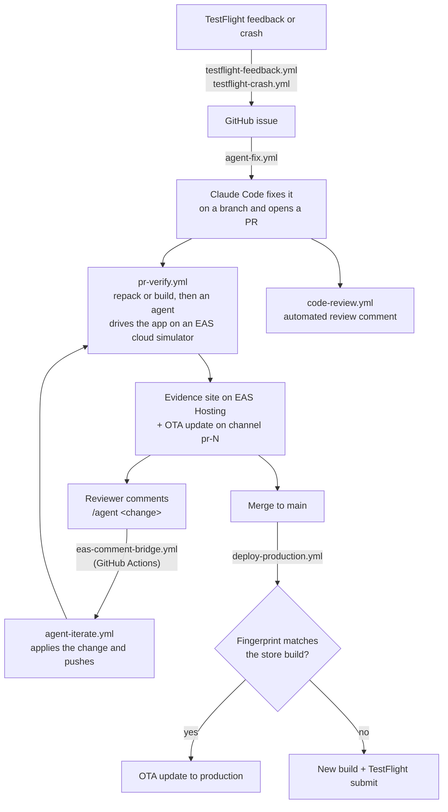

# PickPulse 🏀🏈⚾

A small sports-picks app (Expo + expo-router) with an **agentic CI
pipeline built on [EAS Workflows](https://docs.expo.dev/eas/workflows/introduction/)**.
The app exists to give the pipeline something real to work on. The
pipeline is the point: AI agents file issues, fix them, verify the fix
on a cloud simulator, review the diff, respond to reviewer comments,
and ship — with no laptop in the loop.

## How it works



Every stage is a YAML file in [.eas/workflows/](.eas/workflows/) plus a
small script in [scripts/agent/](scripts/agent/). Each agent is a
headless [Claude Code](https://claude.com/claude-code) run with a
narrow prompt and a narrow `--allowedTools` list.

| Stage | Workflow | What happens |
| --- | --- | --- |
| Intake | [testflight-feedback.yml](.eas/workflows/testflight-feedback.yml), [testflight-crash.yml](.eas/workflows/testflight-crash.yml) | TestFlight feedback or a crash log becomes a GitHub issue, then the fix workflow is dispatched |
| Fix | [agent-fix.yml](.eas/workflows/agent-fix.yml) | An agent reads the issue, edits the code, checks `tsc` passes, opens a PR |
| Verify | [pr-verify.yml](.eas/workflows/pr-verify.yml) | An agent installs the PR build on an EAS cloud simulator, taps through the change, publishes screenshot evidence to EAS Hosting, and ships the PR as an OTA update on channel `pr-N` |
| Review | [code-review.yml](.eas/workflows/code-review.yml) | An agent reviews the diff and posts a verdict comment |
| Iterate | [eas-comment-bridge.yml](.github/workflows/eas-comment-bridge.yml) → [agent-iterate.yml](.eas/workflows/agent-iterate.yml) | A reviewer comments `/agent <change>`; an agent applies it and pushes; verify and review re-run |
| Ship | [deploy-production.yml](.eas/workflows/deploy-production.yml) | On merge, a fingerprint check picks between an instant OTA update and a new build + TestFlight submit |
| QA (on demand) | [qa-to-maestro.yml](.eas/workflows/qa-to-maestro.yml) | A QA agent tests what a PR changed on a cloud simulator; a second agent turns the session log into a Maestro flow and proves it passes, then suggests it in a PR comment |
| E2E (on demand) | [maestro-e2e.yml](.eas/workflows/maestro-e2e.yml) | Runs the adopted Maestro flows in [.maestro/flows/](.maestro/flows/) |

## Run the app locally

```sh
npm install
npx expo start
```

## Set it up for your own project

1. **Link EAS and GitHub.** Run `npx eas-cli@latest init`, then connect
   the repo on expo.dev → project → Settings → GitHub. This enables the
   `push` and `pull_request` triggers.
2. **Connect App Store Connect** (expo.dev → project → Settings →
   Connections) to enable the `app_store_connect.beta_feedback`
   triggers. Set your ASC app id in `eas.json` → `submit.production.ios.ascAppId`.
3. **Replace the identifiers.** Change the bundle id
   (`com.jacobhammerle.pickpulse`) in `app.json`,
   `scripts/agent/verify-on-simulator.sh` (two places),
   `scripts/agent/qa-to-maestro.sh`, and
   `.maestro/flows/app-launches.yaml`. Set your own `owner` and `slug`
   in `app.json`.
4. **EAS environment variables** (expo.dev → project → Environment
   variables):

   | Name | Environments | Value |
   | --- | --- | --- |
   | `CLAUDE_CODE_OAUTH_TOKEN` | production + preview | Claude Code token — the agents run on it |
   | `EXPO_TOKEN` | production + preview | EAS access token (robot user recommended) |
   | `GH_REPO` | production + preview | `<owner>/<repo>` |
   | `GITHUB_TOKEN` | production only | Fine-grained GitHub PAT scoped to this one repo |

5. **GitHub Actions secrets** (for the `/agent` comment bridge):
   `EXPO_TOKEN` and `EAS_PROJECT_ID` (the `extra.eas.projectId` from
   `app.json`).
6. **EAS Simulator access.** The verify and QA jobs need EAS Simulator
   sessions (limited access). Check with
   `npx eas-cli@latest simulator:availability --json`. Without it, swap
   the verify job for a `maestro` job.

## Security

No credentials live in this repo. Three gates protect the ones the
workflows use:

1. **The `/agent` bridge is gated.** Only the repo owner, org members,
   and collaborators can dispatch the iterate workflow
   ([eas-comment-bridge.yml](.github/workflows/eas-comment-bridge.yml)).
2. **PR-triggered agent jobs refuse detectable fork PRs.**
   [pr-verify.yml](.eas/workflows/pr-verify.yml) and
   [code-review.yml](.eas/workflows/code-review.yml) run scripts from
   the PR branch with secrets in the environment, so they exit first
   when the PR's head repo is not this repo. EAS does not document
   fork-PR handling — treat the guard as a backstop and scope your
   tokens tightly.
3. **Agents get narrow tools.** Every headless Claude Code run has an
   explicit `--allowedTools` list. The QA agent can only touch the
   device through a logging wrapper
   ([device.sh](scripts/agent/device.sh)), so every action it takes is
   on the record.

## Repository map

| Path | Purpose |
| --- | --- |
| [src/app/](src/app/) | The app: picks board, slip modal, settings screen with channel surfing |
| [.eas/workflows/](.eas/workflows/) | The agentic pipeline (EAS Workflows) |
| [.github/workflows/](.github/workflows/) | The `/agent` comment bridge (GitHub Actions) |
| [scripts/agent/](scripts/agent/) | Agent prompts and helpers: fix, iterate, review, verify, QA, GitHub API, evidence site |
| [.maestro/flows/](.maestro/flows/) | Adopted Maestro regression flows |
