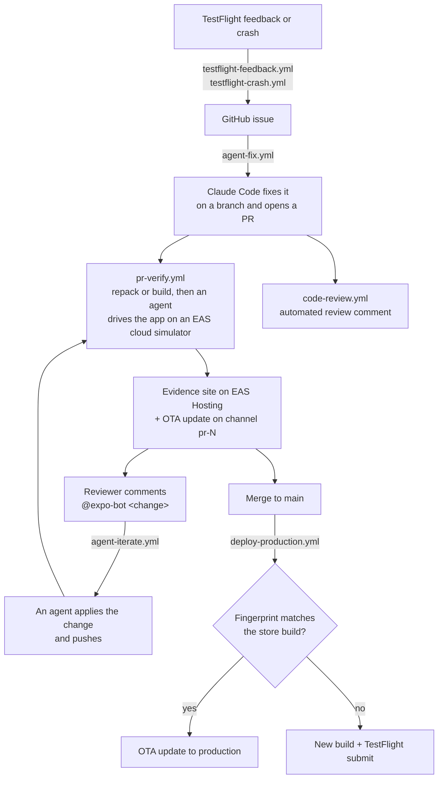

# PickPulse 🏀🏈⚾

A small sports-picks app (Expo + expo-router) with an **agentic CI
pipeline built on [EAS Workflows](https://docs.expo.dev/eas/workflows/introduction/)**.
The app exists to give the pipeline something real to work on. The
pipeline is the point: AI agents file issues, fix them, verify the fix on
a cloud simulator, review the diff, respond to reviewer comments, and
ship — with no laptop in the loop.

## The app

Three screens, iOS only, dark theme:

| Screen | What it does |
| --- | --- |
| **Board** | Tonight's prop lines. Tap **More ↑** or **Less ↓** on a card to add a pick |
| **Your Slip** | The picks, an entry amount, the multiplier (2–6 picks) and potential payout, and a submit button |
| **Preview Channel** (⚙︎) | Shows what is running (channel, runtime, update) and lets you **switch update channels live** — surf to any PR's `pr-N` channel on a release build |

## The pipeline at a glance


```mermaid
flowchart TD
    A[TestFlight feedback or crash] -- "testflight-feedback.yml<br/>testflight-crash.yml" --> B[GitHub issue]
    B -- "agent-fix.yml" --> C[Claude Code fixes it<br/>on a branch and opens a PR]
    C --> D["pr-verify.yml<br/>repack or build, then an agent<br/>drives the app on an EAS cloud simulator"]
    C --> E["code-review.yml<br/>automated review comment"]
    D --> F["Evidence site on EAS Hosting<br/>+ OTA update on channel pr-N"]
    F --> G["Reviewer comments<br/>@expo-bot &lt;change&gt;"]
    G -- "agent-iterate.yml" --> H[An agent applies the change<br/>and pushes]
    H --> D
    F --> I[Merge to main]
    I -- "deploy-production.yml" --> J{Fingerprint matches<br/>the store build?}
    J -- yes --> K[OTA update to production]
    J -- no --> L[New build + TestFlight submit]
```

Every stage is a YAML file in [.eas/workflows/](.eas/workflows/) plus a
small script in [scripts/agent/](scripts/agent/). Each agent is a
headless [Claude Code](https://claude.com/claude-code) run with a narrow
prompt, a narrow `--allowedTools` list, and a wall-clock timeout. Every
stage reports back as one GitHub comment in the same shape: a `🤖`
heading, a **Verdict** or **Status** line with a status emoji, a short
list of links, a row of screenshot thumbnails, and the full report
folded away.

| Stage | Trigger | Workflow | Script |
| --- | --- | --- | --- |
| Intake | TestFlight feedback or crash | [testflight-feedback.yml](.eas/workflows/testflight-feedback.yml), [testflight-crash.yml](.eas/workflows/testflight-crash.yml) | [create-issue-from-feedback.mjs](scripts/agent/create-issue-from-feedback.mjs), [create-issue-from-crash.mjs](scripts/agent/create-issue-from-crash.mjs) |
| Fix | intake, or `@expo-bot` on an issue | [agent-fix.yml](.eas/workflows/agent-fix.yml) | [fix-issue.sh](scripts/agent/fix-issue.sh) |
| Verify | every PR, or `@expo-bot review` | [pr-verify.yml](.eas/workflows/pr-verify.yml) | [verify-on-simulator.sh](scripts/agent/verify-on-simulator.sh) + [expo-bot-verify-prompt.md](.eas/expo-bot-verify-prompt.md) |
| Review | every PR, or `@expo-bot review` | [code-review.yml](.eas/workflows/code-review.yml) | [review-pr.sh](scripts/agent/review-pr.sh) |
| Iterate | `@expo-bot <change>` | [agent-iterate.yml](.eas/workflows/agent-iterate.yml) | [iterate-pr.sh](scripts/agent/iterate-pr.sh) |
| Preview | `@expo-bot preview` | [pr-live-preview.yml](.eas/workflows/pr-live-preview.yml) | [pr-live-preview.sh](scripts/agent/pr-live-preview.sh) |
| QA | `@expo-bot qa` | [qa-to-maestro.yml](.eas/workflows/qa-to-maestro.yml) | [qa-to-maestro.sh](scripts/agent/qa-to-maestro.sh) |
| E2E | on demand | [maestro-e2e.yml](.eas/workflows/maestro-e2e.yml) | — |
| Ship | push to `main` | [deploy-production.yml](.eas/workflows/deploy-production.yml) | — |

## How to use it

**Open a pull request against `main`.** That is the whole interface.
Within a few minutes two comments land on the PR without anyone asking:

1. **🤖 Automated code review** — a verdict (✅ LGTM or ⚠️ Needs
   changes), a one-line summary, and the notes folded away.
2. **🤖 Agent verification** — PASS or FAIL, a link to the evidence site,
   the `pr-N` channel to surf to on your phone, screenshot thumbnails,
   and the agent's report folded away.

Then **talk to the bot** by commenting on the PR:

| Comment | What happens |
| --- | --- |
| `@expo-bot <change>` | An agent applies the change to the PR branch and pushes. Review and verify re-run on the new commit. Example: `@expo-bot make the slip bar purple` |
| `@expo-bot review [guidance]` | Review and verify again. Guidance is binding: `@expo-bot review the slip must show a 3x multiplier for two picks` makes that an acceptance criterion |
| `@expo-bot preview [minutes] [device]` | A cloud iOS simulator running this PR, in your browser. `@expo-bot preview`, `@expo-bot preview 45`, `@expo-bot preview iPhone 17 Pro for 45` |
| `@expo-bot qa [guidance]` | A QA agent explores what the PR changed; a second agent writes a Maestro regression flow from the session and suggests it on the PR |

On an **issue**, `@expo-bot [guidance]` sends it to the fix agent, which
opens a PR; the PR then gets review, verification, and its own update
channel without another word. A 👀 reaction means the comment was heard.

The PR commands run natively on EAS through the `pull_request_comment`
trigger. Only the repo owner, org members, and collaborators can drive
the bot; fork PRs never trigger comment runs. Every workflow can also be
run by hand from a checkout of the branch in question:

```sh
npx eas-cli@latest workflow:run .eas/workflows/pr-verify.yml -F pr_number=12
npx eas-cli@latest workflow:run .eas/workflows/code-review.yml -F pr_number=12
npx eas-cli@latest workflow:run .eas/workflows/agent-iterate.yml -F pr_number=12 -F instruction="make the slip bar purple"
npx eas-cli@latest workflow:run .eas/workflows/pr-live-preview.yml -F pr_number=12 -F device="iPhone 17 Pro"
npx eas-cli@latest workflow:run .eas/workflows/qa-to-maestro.yml -F pr_number=12
npx eas-cli@latest workflow:run .eas/workflows/agent-fix.yml -F issue_number=7
```

Every run also appears on the EAS dashboard under **Workflows**, with the
jobs numbered by stage so a run reads top to bottom, and every cloud
simulator session under **Simulator sessions**, named after the PR or
issue it served.

## The flows, one by one

### Intake: TestFlight feedback becomes an issue

**Trigger:** a tester submits feedback with a screenshot, or a crash
report arrives, in the TestFlight build. App Store Connect fires the
workflow.

1. The submission is fetched by id (comment, tester, device,
   screenshots, or the symbolicated crash log).
2. A GitHub issue is filed with the tester's words, the screenshots
   inline, and the raw payload folded away.
3. [agent-fix.yml](.eas/workflows/agent-fix.yml) is dispatched on the
   new issue.

Two workflow files, one per event type, because the trigger context
arrives uninterpolated on some runs and the type must be known
statically. Run either by hand against the newest submission with
`eas workflow:run .eas/workflows/testflight-feedback.yml`.

### Fix: an issue becomes a pull request

**Trigger:** intake, or `@expo-bot [guidance]` on an issue, or a manual
run with `issue_number`.

1. Claude Code reads the issue (and the guidance, which is binding) and
   makes the smallest fix under `src/`. Allowed tools: read, edit,
   `npx tsc`. Ten-minute cap.
2. A hard gate: `npx tsc --noEmit` must pass, or nothing is pushed.
3. The change is committed to `fix/issue-N` and a PR is opened that
   closes the issue. The PR body says what lands next: review,
   verification, and the `pr-N` channel.
4. The issue gets a **🤖 Agent fix** comment with the PR link. If the
   agent made no change, or the gate failed, the comment says so and
   how to retry with more guidance.

### Verify: an agent taps through the PR on a cloud simulator

**Trigger:** every PR into `main` (open and every push), `@expo-bot
review [guidance]`, or a manual run with `pr_number`.

1. **Fingerprint** the PR's native code.
2. **Find** an existing `preview-simulator` build with the same
   fingerprint, or **build** one when native code changed.
3. **Repack** the found binary with the PR's JavaScript. No shared
   channel is touched, so any number of PRs verify in parallel.
4. **Publish** the PR's JavaScript to its own EAS Update channel,
   `pr-N`, for humans.
5. **Verify.** [verify-on-simulator.sh](scripts/agent/verify-on-simulator.sh)
   boots an EAS cloud simulator with `simulator:start --build-id`, so
   the app is installed and launched before the session is ready. It
   fetches the PR title and diff, confirms the app rendered a UI tree,
   then hands Claude Code the prompt in
   [expo-bot-verify-prompt.md](.eas/expo-bot-verify-prompt.md): derive
   the 2–4 user-visible behaviors the diff changes, check each one on
   the device, screenshot the proof, write a PASS or FAIL verdict. The
   agent can only touch the device through
   [device.sh](scripts/agent/device.sh), which logs every command.
   Twenty-minute cap; no verdict file counts as a FAIL.
6. **Evidence.** [eas-simulator-evidence](https://github.com/jacobhammerle/eas-simulator-evidence)
   stops the session, collects its own artifacts (action timeline, CPU
   and memory samples, the screen recording), builds a static page with
   the verdict, the screenshots, and the report, and deploys it to EAS
   Hosting at `pr-N-evidence`.
7. **Comment.** One **🤖 Agent verification** comment on the PR: the
   verdict with its badge, the evidence link, the `pr-N` channel, four
   thumbnails, and the report folded away. If anything fails after the
   verdict, the comment still carries the verdict and says what broke.

A diff that is not UI-observable (CI, scripts, docs) gets one smoke
interaction and a PASS with that reasoning.

### Review: a code review on every PR

**Trigger:** the same as verify.

The diff comes from the GitHub API, so the review is identical whether
the run came from a push, a comment, or the CLI. Claude Code reads the
diff and the PR body (read-only tools, ten-minute cap) and writes a
fixed-shape review: a verdict, a one-line summary, a correctness check,
and bugs or risks. The verdict and summary stay visible in the
**🤖 Automated code review** comment; the notes fold away. Reviewer
guidance from `@expo-bot review <guidance>` becomes the review's focus.

### Iterate: a reviewer asks for a change in plain words

**Trigger:** `@expo-bot <change>` on a PR (anything that is not one of
the other commands), or a manual run with `pr_number` and `instruction`.

1. The script checks out the PR branch inside the EAS job.
2. Claude Code applies the smallest change that satisfies the request
   (read, edit, `npx tsc`; ten-minute cap). It is told not to touch
   `.eas/`, `.github/`, or `scripts/` unless asked.
3. `npx tsc --noEmit` must pass.
4. The change is committed as `expo-bot: <instruction>` and pushed to
   the PR branch. That push re-triggers review and verify, so the PR
   gets a fresh verdict and fresh evidence with no further input.
5. **🤖 Agent iteration** on the PR says what was requested and what
   happened: applied (with the commit), no change needed, or errored.

### Preview: the PR's app in your browser

**Trigger:** `@expo-bot preview [minutes] [device]` on a PR, or a manual
run with `pr_number`, `duration_minutes`, and `device`.

The same fingerprint → find or build → repack chain as verify, then the
job boots a cloud iOS simulator with the repacked binary preinstalled,
capped at the requested length (30 minutes by default), and comments
**🤖 Live preview** with the browser link, the session id to stop it
early, and the retry command. [parse-preview-args.sh](scripts/agent/parse-preview-args.sh)
reads the minutes and the device name in any order, so
`@expo-bot preview iPhone 17 Pro for 45` works. The device name goes
straight to `eas simulator:start --device`. Use a device from the runner's
current iOS runtime (`iPhone 17 Pro`, `iPhone 17`); when the runner does
not have the device, the session falls back to the default device and the
comment says so.

### QA: an exploratory test becomes a Maestro flow

**Trigger:** `@expo-bot qa [guidance]` on a PR, or a manual run with
`pr_number` (or `feature` to describe something to test without a PR).

1. The script finds the finished `preview-simulator` build for the PR's
   head commit (the one verify made) and boots a cloud simulator with it.
2. **Agent 1, the QA tester,** reads the PR diff, writes a short test
   plan for exactly the behavior that changed, and executes it on the
   device — only through [device.sh](scripts/agent/device.sh), which
   appends every command and its full output to a session log. It takes
   a UI snapshot before and after every action and writes a report
   ending in `RESULT: PASS` or `RESULT: FAIL`.
3. The simulator is stopped; it is not needed for what follows.
4. **Agent 2, the flow author,** starts with a fresh context, reads only
   the session log and the report, and writes a deterministic Maestro
   flow: every tap mapped back to the visible text or accessibility
   label the log recorded, every assertion quoting the text the tester
   verified, one comment per step saying which log step it replays.
5. A `maestro` job replays the generated flow against the same build to
   prove it passes.
6. **🧪 Suggested Maestro regression test** lands on the PR with the
   flow YAML inline. Nothing is pushed; the author adopts it by
   committing the file to `.maestro/flows/`.

[maestro-e2e.yml](.eas/workflows/maestro-e2e.yml) runs the adopted
flows on demand against a repacked or fresh build with screen recording
on: `eas workflow:run .eas/workflows/maestro-e2e.yml`.

### Ship: merge to main

**Trigger:** every push to `main`.

A fingerprint check decides how the change reaches TestFlight phones.
When a store build with the same fingerprint exists, the JavaScript is
published as an over-the-air update to the `production` channel and
installed apps pick it up in seconds. When native code changed, a new
production build is made and submitted to TestFlight automatically.
Nobody decides "update or build"; the fingerprint does.

## Channel surfing

Every PR the verify workflow checks gets its own update channel, `pr-N`.
On a release build (the TestFlight install included), open ⚙︎, type the
channel name, and tap **Switch channel**: the app downloads that PR's
update and reloads on the spot. Several PRs can be in flight at once
without touching each other. **Reset to build channel** puts it back.

## Run the app locally

```sh
npm install
npx expo start
```

## Set it up for your own project

1. **Link EAS and GitHub.** Run `npx eas-cli@latest init`, then connect
   the repo on expo.dev → project → Settings → GitHub. This enables the
   `push`, `pull_request`, and `pull_request_comment` triggers.
2. **Connect App Store Connect** (expo.dev → project → Settings →
   Connections) to enable the `app_store_connect.beta_feedback`
   triggers. Set your ASC app id in `eas.json` → `submit.production.ios.ascAppId`.
3. **Replace the identifiers.** Change the bundle id
   (`com.jacobhammerle.pickpulse`) in `app.json`,
   `scripts/agent/verify-on-simulator.sh`, `scripts/agent/qa-to-maestro.sh`,
   `.eas/expo-bot-verify-prompt.md`, and `.maestro/flows/app-launches.yaml`.
   Set your own `owner` and `slug` in `app.json`.
4. **EAS environment variables** (expo.dev → project → Environment
   variables):

   | Name | Environments | Value |
   | --- | --- | --- |
   | `CLAUDE_CODE_OAUTH_TOKEN` | production + preview | Claude Code token (`claude setup-token`) — the agents run on it |
   | `EXPO_TOKEN` | production + preview | EAS access token with EAS Simulator access |
   | `GH_REPO` | production + preview | `<owner>/<repo>` |
   | `GITHUB_TOKEN` | production only | Fine-grained GitHub PAT scoped to this one repo: contents, issues, and pull requests read/write |

5. **GitHub Actions secrets** (for the issue-comment bridge):
   `EXPO_TOKEN` and `EAS_PROJECT_ID` (the `extra.eas.projectId` from
   `app.json`).
6. **EAS Simulator access.** The verify, preview, and QA jobs need EAS
   Simulator sessions (limited access). Check with
   `npx eas-cli@latest simulator:availability --json`. Without it, swap
   the verify job for a `maestro` job.

## Security

No credentials live in this repo. Three gates protect the ones the
workflows use:

1. **Comment commands are gated.** Every comment-triggered workflow
   checks the commenter's association first: only the repo owner, org
   members, and collaborators can drive the bot, on EAS (the `if` on the
   first job) and in the GitHub Action alike. Fork PRs never trigger
   comment runs.
2. **PR-triggered agent jobs refuse detectable fork PRs.**
   [pr-verify.yml](.eas/workflows/pr-verify.yml) and
   [code-review.yml](.eas/workflows/code-review.yml) run scripts from
   the PR branch with secrets in the environment, so they exit first
   when the PR's head repo is not this repo. EAS does not document
   fork-PR handling — treat the guard as a backstop and scope your
   tokens tightly.
3. **Agents get narrow tools.** Every headless Claude Code run has an
   explicit `--allowedTools` list and a wall-clock timeout. The verify
   and QA agents can only touch the device through a logging wrapper
   ([device.sh](scripts/agent/device.sh)), so every action they take is
   on the record.

## Repository map

| Path | Purpose |
| --- | --- |
| [src/app/](src/app/) | The app: picks board, slip modal, Preview Channel screen with channel surfing |
| [.eas/workflows/](.eas/workflows/) | The agentic pipeline (EAS Workflows), one file per stage |
| [.eas/expo-bot-verify-prompt.md](.eas/expo-bot-verify-prompt.md) | The verification agent's prompt |
| [.github/workflows/](.github/workflows/) | The `@expo-bot` bridge (GitHub Actions): 👀 reactions and issue comments |
| [scripts/agent/](scripts/agent/) | One script per stage: fix, iterate, review, verify, preview, QA, plus the GitHub API and comment helpers |
| [.maestro/flows/](.maestro/flows/) | Adopted Maestro regression flows |
