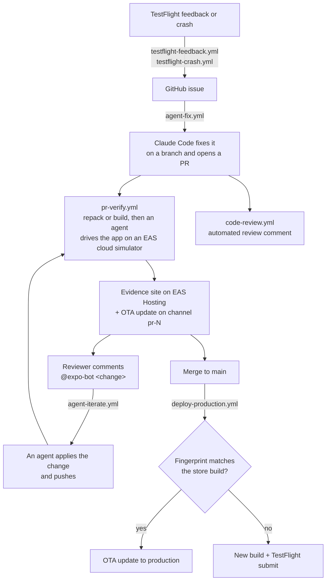

# PickPulse 🏀🏈⚾

A small sports-picks app (Expo + expo-router) with an **agentic CI
pipeline built on [EAS Workflows](https://docs.expo.dev/eas/workflows/introduction/)**.
The app exists to give the pipeline something real to work on. The
pipeline is the point: AI agents file issues, fix them, verify the fix on
a cloud simulator, review the diff, respond to reviewer comments, and
ship — with no laptop in the loop.

## The app

Three screens, iOS only, dark theme:

| Screen | What it does |
| --- | --- |
| **Board** | Tonight's prop lines. Tap **More ↑** or **Less ↓** on a card to add a pick |
| **Your Slip** | The picks, an entry amount, the multiplier (2–6 picks) and potential payout, and a submit button |
| **Preview Channel** (⚙︎) | Shows what is running (channel, runtime, update) and lets you **switch update channels live** — surf to any PR's `pr-N` channel on a release build |

## How it works


```mermaid
flowchart TD
    A[TestFlight feedback or crash] -- "testflight-feedback.yml<br/>testflight-crash.yml" --> B[GitHub issue]
    B -- "agent-fix.yml" --> C[Claude Code fixes it<br/>on a branch and opens a PR]
    C --> D["pr-verify.yml<br/>repack or build, then an agent<br/>drives the app on an EAS cloud simulator"]
    C --> E["code-review.yml<br/>automated review comment"]
    D --> F["Evidence site on EAS Hosting<br/>+ OTA update on channel pr-N"]
    F --> G["Reviewer comments<br/>@expo-bot &lt;change&gt;"]
    G -- "agent-iterate.yml" --> H[An agent applies the change<br/>and pushes]
    H --> D
    F --> I[Merge to main]
    I -- "deploy-production.yml" --> J{Fingerprint matches<br/>the store build?}
    J -- yes --> K[OTA update to production]
    J -- no --> L[New build + TestFlight submit]
```

Every stage is a YAML file in [.eas/workflows/](.eas/workflows/) plus a
small script in [scripts/agent/](scripts/agent/). Each agent is a
headless [Claude Code](https://claude.com/claude-code) run with a narrow
prompt and a narrow `--allowedTools` list, and every stage reports back
as one GitHub comment in the same shape: a `🤖` heading, a **Verdict** or
**Status** line with a status emoji, a short list of links, a row of
screenshot thumbnails, and the full report folded away.

The evidence site itself (verdict, screenshots, the agent's action
timeline, CPU and memory charts, the session recording) comes from
[eas-simulator-evidence](https://github.com/jacobhammerle/eas-simulator-evidence),
an open-source package that grew out of this kind of pipeline. The verify
script calls its `run` command to collect the session's artifacts, build
the page, and deploy it to EAS Hosting, and its `comment` command for the
PR comment shape.

| Stage | Workflow | What happens |
| --- | --- | --- |
| Intake | [testflight-feedback.yml](.eas/workflows/testflight-feedback.yml), [testflight-crash.yml](.eas/workflows/testflight-crash.yml) | TestFlight feedback or a crash log becomes a GitHub issue, then the fix workflow is dispatched |
| Fix | [agent-fix.yml](.eas/workflows/agent-fix.yml) | An agent reads the issue, edits the code, checks `tsc` passes, opens a PR on `fix/issue-N` |
| Verify | [pr-verify.yml](.eas/workflows/pr-verify.yml) | The PR's JS is repacked into a fingerprint-matched simulator binary (or a new one is built), an agent derives checks from the diff and taps through them on an EAS cloud simulator, screenshot evidence goes to EAS Hosting, and the PR's JS ships as an OTA update on channel `pr-N` |
| Review | [code-review.yml](.eas/workflows/code-review.yml) | An agent reviews the diff and posts a verdict comment |
| Iterate | [agent-iterate.yml](.eas/workflows/agent-iterate.yml) | A reviewer comments `@expo-bot <change>`; an agent applies it and pushes; verify and review re-run on the new commit |
| Preview | [pr-live-preview.yml](.eas/workflows/pr-live-preview.yml) | `@expo-bot preview` boots a browser-accessible cloud simulator running the PR and posts the link |
| QA | [qa-to-maestro.yml](.eas/workflows/qa-to-maestro.yml) | `@expo-bot qa` has a QA agent test what the PR changed on a cloud simulator; a second agent turns the session log into a Maestro flow, proves it passes, and suggests it in a PR comment |
| Ship | [deploy-production.yml](.eas/workflows/deploy-production.yml) | On merge, a fingerprint check picks between an instant OTA update and a new build + TestFlight submit |
| E2E (on demand) | [maestro-e2e.yml](.eas/workflows/maestro-e2e.yml) | Runs the adopted Maestro flows in [.maestro/flows/](.maestro/flows/) |

## Talk to the bot

Comment on a pull request. The PR commands run natively on EAS through the
`pull_request_comment` trigger; the GitHub Action
([expo-bot-bridge.yml](.github/workflows/expo-bot-bridge.yml)) only adds a
👀 reaction and routes issue comments.

| Comment | What happens |
| --- | --- |
| `@expo-bot <change>` | An agent applies the change to the PR branch and pushes; review + verify re-run. Example: `@expo-bot make the slip bar purple` |
| `@expo-bot review [guidance]` | Code review and a cloud-simulator verification, again. Guidance is binding: `@expo-bot review the slip must show a 3x multiplier for two picks` |
| `@expo-bot preview [minutes] [device]` | A cloud iOS simulator running this PR, in your browser. `@expo-bot preview`, `@expo-bot preview 45`, `@expo-bot preview iPhone 16 Pro for 45` |
| `@expo-bot qa [guidance]` | A QA agent explores what the PR changed; a second agent writes a Maestro regression flow from the session and suggests it on the PR |

On an **issue**, `@expo-bot [guidance]` sends it to the fix agent, which
opens a PR; the PR then gets review, verification, and its own update
channel without another word.

Any of these can also be run by hand from a checkout of the PR branch,
for example:

```sh
npx eas-cli@latest workflow:run .eas/workflows/pr-verify.yml -F pr_number=12
npx eas-cli@latest workflow:run .eas/workflows/qa-to-maestro.yml -F pr_number=12
```

## Channel surfing

Every PR the verify workflow checks gets its own update channel, `pr-N`.
On a release build (the TestFlight install included), open ⚙︎, type the
channel name, and tap **Switch channel**: the app downloads that PR's
update and reloads on the spot. Several PRs can be in flight at once
without touching each other. **Reset to build channel** puts it back.

## Run the app locally

```sh
npm install
npx expo start
```

## Set it up for your own project

1. **Link EAS and GitHub.** Run `npx eas-cli@latest init`, then connect
   the repo on expo.dev → project → Settings → GitHub. This enables the
   `push`, `pull_request`, and `pull_request_comment` triggers.
2. **Connect App Store Connect** (expo.dev → project → Settings →
   Connections) to enable the `app_store_connect.beta_feedback`
   triggers. Set your ASC app id in `eas.json` → `submit.production.ios.ascAppId`.
3. **Replace the identifiers.** Change the bundle id
   (`com.jacobhammerle.pickpulse`) in `app.json`,
   `scripts/agent/verify-on-simulator.sh`, `scripts/agent/qa-to-maestro.sh`,
   `.eas/expo-bot-verify-prompt.md`, and `.maestro/flows/app-launches.yaml`.
   Set your own `owner` and `slug` in `app.json`.
4. **EAS environment variables** (expo.dev → project → Environment
   variables):

   | Name | Environments | Value |
   | --- | --- | --- |
   | `CLAUDE_CODE_OAUTH_TOKEN` | production + preview | Claude Code token (`claude setup-token`) — the agents run on it |
   | `EXPO_TOKEN` | production + preview | EAS access token with EAS Simulator access |
   | `GH_REPO` | production + preview | `<owner>/<repo>` |
   | `GITHUB_TOKEN` | production only | Fine-grained GitHub PAT scoped to this one repo: contents, issues, and pull requests read/write |

5. **GitHub Actions secrets** (for the issue-comment bridge):
   `EXPO_TOKEN` and `EAS_PROJECT_ID` (the `extra.eas.projectId` from
   `app.json`).
6. **EAS Simulator access.** The verify, preview, and QA jobs need EAS
   Simulator sessions (limited access). Check with
   `npx eas-cli@latest simulator:availability --json`. Without it, swap
   the verify job for a `maestro` job.

## Security

No credentials live in this repo. Three gates protect the ones the
workflows use:

1. **Comment commands are gated.** Every comment-triggered workflow
   checks the commenter's association first: only the repo owner, org
   members, and collaborators can drive the bot, on EAS (the `if` on the
   first job) and in the GitHub Action alike. Fork PRs never trigger
   comment runs.
2. **PR-triggered agent jobs refuse detectable fork PRs.**
   [pr-verify.yml](.eas/workflows/pr-verify.yml) and
   [code-review.yml](.eas/workflows/code-review.yml) run scripts from
   the PR branch with secrets in the environment, so they exit first
   when the PR's head repo is not this repo. EAS does not document
   fork-PR handling — treat the guard as a backstop and scope your
   tokens tightly.
3. **Agents get narrow tools.** Every headless Claude Code run has an
   explicit `--allowedTools` list and a wall-clock timeout. The verify
   and QA agents can only touch the device through a logging wrapper
   ([device.sh](scripts/agent/device.sh)), so every action they take is
   on the record.

## Repository map

| Path | Purpose |
| --- | --- |
| [src/app/](src/app/) | The app: picks board, slip modal, Preview Channel screen with channel surfing |
| [.eas/workflows/](.eas/workflows/) | The agentic pipeline (EAS Workflows) |
| [.eas/expo-bot-verify-prompt.md](.eas/expo-bot-verify-prompt.md) | The verification agent's prompt |
| [.github/workflows/](.github/workflows/) | The `@expo-bot` bridge (GitHub Actions): 👀 reactions and issue comments |
| [scripts/agent/](scripts/agent/) | One script per stage: fix, iterate, review, verify, preview, QA, plus the GitHub API and comment helpers |
| [.maestro/flows/](.maestro/flows/) | Adopted Maestro regression flows |
